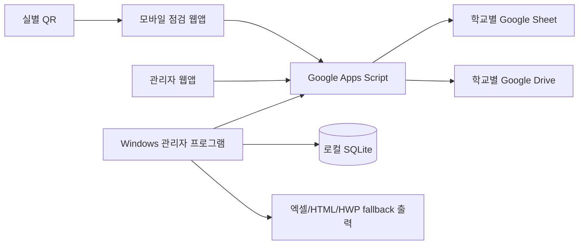

# QR보안점검표 Google Drive 중간서버형 무료배포 시스템

이 프로젝트는 기존 Flask + SQLite 기반 QR보안점검표를 학교별 Google Drive / Google Sheet / Google Apps Script 구조로 재구축한 무료 배포용 시스템입니다.

중앙 서버, 개발자 NAS, 유료 클라우드 서버를 쓰지 않습니다. 각 학교가 자기 Google 계정의 Sheet와 Drive를 저장소로 사용합니다.

## 기존 시스템과의 차이

기존 방식은 학교 PC에서 Flask 서버가 켜져 있어야 스마트폰 QR 제출과 관리자 확인이 가능했습니다. 새 방식은 Google Apps Script 웹앱이 중간 계층이므로 학교 PC가 꺼져 있어도 점검자는 QR 제출을 할 수 있고, 관리자는 퇴근 후에도 관리자 웹앱에서 Google에 저장된 결과를 볼 수 있습니다.



## 왜 점검자는 Google 로그인이 필요 없나

Apps Script 웹앱을 학교 관리자 계정 권한으로 실행하도록 배포하면, 점검자는 Google Drive 권한 없이도 QR 화면에 접속해 제출할 수 있습니다. 제출 권한은 Google 로그인 대신 `room_id + submit_token` QR 링크로 검증합니다.

## 왜 관리자는 최초 1회 Google 권한 승인이 필요한가

Sheet에 기록하고 Drive에 첨부파일을 저장하려면 Google 정책상 파일 소유자인 학교 관리자 계정이 Apps Script 권한을 승인해야 합니다. 이메일만 입력한다고 그 사람의 Drive에 자동 업로드할 수는 없습니다.

## 프로젝트 구성

- `apps-script/`: Google Apps Script 웹앱 코드
- `admin-desktop/`: PySide6 Windows 관리자 프로그램
- `docs/`: 설치, 운영, 보안, 인증, 출력 문서
- `legacy/original/`: 기존 Flask 소스 분석용 추출본
- `sample-data/`: 샘플 제출 데이터와 설정 안내

## Apps Script 배포 요약

1. 학교 관리자 Google 계정으로 Google Sheet를 만든다.
2. `확장 프로그램 > Apps Script`를 연다.
3. `apps-script/` 폴더의 `.gs`, `.html`, `appsscript.json` 파일을 같은 이름으로 만든다.
4. `?page=setup` 화면 또는 `setup.initialize` 함수로 초기 설정을 실행한다.
5. Google 권한을 승인한다.
6. `배포 > 새 배포 > 웹 앱`에서 실행 사용자는 `나`, 접근 권한은 점검자 무로그인을 위해 `모든 사용자`로 배포한다.
7. 배포 URL을 Windows 관리자 프로그램 설정에 입력한다.

자세한 단계는 `docs/02_Google_Apps_Script_배포가이드.md`와 `docs/04_학교별_초기설정_가이드.md`를 보세요.

## Windows 관리자 프로그램 실행

PowerShell에서:

```powershell
Set-Location D:\gpt\QR\qr-security-check\admin-desktop
python -m venv .venv
.\.venv\Scripts\python.exe -m pip install --upgrade pip
.\.venv\Scripts\python.exe -m pip install -r requirements.txt
.\scripts\run_dev.ps1 -SkipInstall
```

테스트:

```powershell
Set-Location D:\gpt\QR\qr-security-check\admin-desktop
.\scripts\build.ps1
```

실행파일 빌드:

```powershell
Set-Location D:\gpt\QR\qr-security-check\admin-desktop
.\scripts\package.ps1
```

## 관리자 프로그램 주요 기능

- 최초 설정: 학교명, 관리자 이메일, Apps Script URL, Desktop Sync Key 입력
- 자동/수동 동기화 구조
- 오늘 대시보드
- 점검기록 날짜별 조회
- 이상 없음 일괄확인
- 이상 있음 상세보기 후 개별확인
- 실/담당자/당직자/점검항목 관리
- 실별 QR PNG와 A4 부착용 HTML 생성
- 엑셀 출력
- HTML 인쇄 출력
- 한글 설치 PC에서는 HWP 선택 변환, 실패 시 HTML fallback

## 보안/개인정보 주의

- 실제 관리자 이메일, Google Client Secret, 관리자 토큰, sync key는 코드에 넣지 마세요.
- QR에는 `room_id + submit_token`이 들어갑니다. QR이 외부에 노출되면 해당 실 토큰을 재발급하세요.
- `submit_token`과 sync key는 서버/Sheet에는 hash로 저장합니다.
- 첨부파일은 이미지/PDF만 허용하며 기본 5MB 제한입니다.
- Google Sheet/Drive는 “링크가 있는 모든 사용자 편집 가능”으로 공유하지 마세요.
- 무료 배포형이므로 고위험 개인정보, 법적 신원 확인, 강한 보안 보증 용도로 쓰지 마세요.

## 학교 담당자 안내문

이 시스템은 보안점검표를 종이 수기철 대신 QR로 제출하고 Google Sheet에 자동 저장하는 무료 배포형 도구입니다. 점검자는 QR 스캔 후 이름을 선택하고 이상이 없으면 바로 제출하면 됩니다. 학교 관리자 1명만 최초 Google 권한 승인을 진행하면 이후 일반 점검자는 별도 Google 로그인 없이 사용할 수 있습니다.

