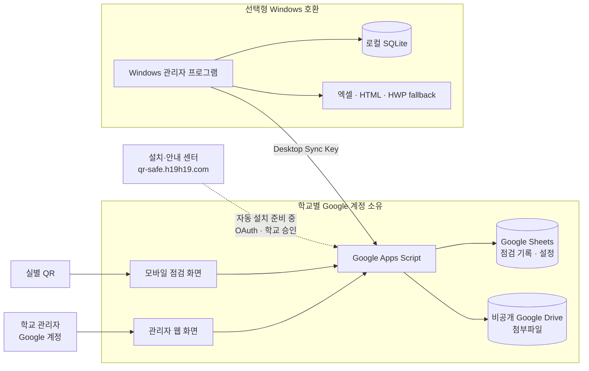

# QR-check — 학교 소유 Google 기반 보안 점검 시스템

> 브라우저 중심 운용. Windows 설치 불필요. 학교별 자체 Google 계정에서 동작.

홈페이지: [QR 보안점검표](http://qr-safe.h19h19.com/)

## 개요

QR-check는 학교가 소유한 Google Apps Script / Sheets / Drive 기반 보안 점검 시스템이다.

- **QR 방문자**: Google 로그인 없이 QR로 점검 제출 (담당자/당직자, 항목별 정상/이상, 사진·PDF 첨부 ≤5MB, 비고)
- **학교 관리자**: Google 신원으로 로그인 후 기록 확인·확정, 날짜 필터, QR 생성, 내보내기
- **중앙 정적 홈페이지**: main / maker / demo / guide / help / update 제공. 기록·비밀·첨부 중앙 저장 없음
- **학교 경계 내 저장**: 점검 기록·설정은 Sheets, 첨부파일은 비공개 Drive에 저장

> 신규 학교 자동 설치는 준비 중입니다. 현재 홈페이지에서는 안내·체험 및 기존 테스트 웹앱 접속을 제공합니다.

## 현재 상태

2026-09-10 업데이트: 기존 테스트 웹앱을 **v12**로 갱신했고, 실제 정상 제출 → 동일 관리자 기록 → 개별확인 및 익명 관리자 거부를 확인했습니다. 구버전 요청 충돌 안내와 자동 재전송 처리를 보강했습니다. 신규 학교 자동 설치와 HTTPS는 아직 준비 중입니다. 상세 범위·미검증 사항은 [최신 진행 보고서](docs/review/LIVE_PROGRESS_20260910.md)를 보세요.

아래는 2026-09-09 기준 이력입니다. 배포 버전과 검증 상태는 위 최신 보고서가 우선합니다.

| 항목 | 상태 |
|---|---|
| 홈페이지 호스팅 | GitHub Pages `gh-pages` 브랜치, 커스텀 도메인 `qr-safe.h19h19.com`, Cloudflare DNS는 `h19h29-design.github.io`로의 CNAME만 설정 |
| 홈페이지 접속 | 2026-09-09 HTTP 확인됨, HTTPS 인증서 발급 대기 중 (당시 확인 기준) |
| 홈페이지 버튼 | 기존 v11 Google 테스트 웹앱을 연다. 합성 기록만 사용. 홈페이지 배포는 Apps Script를 배포하지 않는다 |
| 현재 소스 vs 배포 v11 | 소스가 배포된 v11과 다르다. 상세는 `docs/review/EXISTING_V11_COMPARISON_20260909.md` 참조 |
| 신규 학교 자동 설치 | 차단됨: OAuth 클라이언트 ID 비어 있음, 허용 origin/설정 필요, 릴리스 미발행(런타임 페이로드 없음) |
| 공개 웹사이트 배포 vs 학교 런타임 | 별개이다. 웹사이트 배포됨 ≠ 학교 런타임 릴리스 준비됨 |
| Maker 판정 기준 | 실제 API 결과·승인·VERIFIED만 인정. 데모 합성 기록은 실제 학교 저장소가 아니다 |
| 학교 독립 운용·차단/해지 | 설계상 중앙과 독립 운용. 실제 차단/해지 라이브 검증은 아직 대기 중 |
| 기존 v11 Gmail 실증거 | 정상/이상 사진 제출 → 동일 Sheet/관리자 기록/비공개 Drive 흐름은 과거 v11에서 확인됨 (현행 신규 설치 검증 아님) |
| 현행 소스 로컬 Node 검사 | 2026-09-09 기준 로컬 검사 314건 통과. 신규 라이브 검증 아님 |
| 미검증 항목 | 실물 휴대폰/인쇄 QR, 교육용 Workspace, 설치 OAuth E2E, 실제 롤백, 중앙-독립 테스트 대기 중 |
| 기존/현행 다이제스트 불일치 | 런타임 업그레이드 전 알려진 현안. `docs/review/EXISTING_V11_COMPARISON_20260909.md` 참조 |

## 아키텍처 요약



상세 다이어그램과 경계·권한 설명은 [docs/ARCHITECTURE.md](docs/ARCHITECTURE.md)를 본다.

실선은 운영 데이터 흐름, 점선은 준비 중인 신규 설치 흐름입니다. 공개용·관리자용 분리 빌드 코드는 존재하며, 기존 v11 테스트는 두 화면을 한 웹앱에서 제공하는 결합 배포입니다.

## 소스 구성

| 디렉터리 | 내용 |
|---|---|
| `installer/` | 정적 6개 페이지 및 `auth`/`google`/`install`/`update` 모듈 |
| `apps-script/` | 학교 런타임 |
| `admin-desktop/` | 선택적 레거시 Windows 클라이언트 (일반 웹 사용에 불필요) |
| `tools/` | `build-site.mjs`, `build-runtime.mjs`, `build-release.mjs` |
| `tests/gas/` | 런타임 테스트 |
| `docs/review/`, `docs/operator/`, `docs/user/`, `docs/privacy/` | 검토·운영·사용·개인정보 문서 |
| `legacy/original/` | 분석 전용 |

## 기능 (소스 기준)

- QR 제출 폼: 담당자/당직자, 항목별 정상/이상, 이미지·PDF 첨부(≤5MB 검증), 비고, 기록 상세
- 관리자 확정, 날짜 필터, QR 생성, 내보내기
- 일괄 확정은 정상만 가능. 이상은 상세 확인 후 개별 확정 필요
- 관리자 인증: 학교 config에 등록된 Google 신원만 허용. 빈 신원/미등록 신원 거부. 신규 웹 경로에 공유 admin-token 우회 없음

## 로컬 확인 명령 (저장소 루트, PowerShell)

> 새로운 빈 출력 디렉터리를 선택한다. 빌드는 미발행 사이트이며 설치 가능 릴리스가 아니다.

```powershell
node --experimental-vm-modules --test --test-reporter=spec installer/tests/*.test.mjs installer/src/install/*.test.mjs installer/src/update/*.test.mjs tests/gas/*.test.mjs
node tools/build-site.mjs --out "$env:TEMP/qr-check-site-unique-output"
python -m http.server 57919 --directory "$env:TEMP/qr-check-site-unique-output"
```

런타임 빌드와 Google 승인 설정은 `tools/` 및 아래 운영 문서를 참고하세요.

## 유용한 링크

- [docs/review/EXISTING_V11_COMPARISON_20260909.md](docs/review/EXISTING_V11_COMPARISON_20260909.md)
- [docs/review/LIVE_VALIDATION_REPORT.md](docs/review/LIVE_VALIDATION_REPORT.md)
- [docs/operator/INSTALLER_OAUTH_SETUP.md](docs/operator/INSTALLER_OAUTH_SETUP.md)
- [docs/privacy/DATA_FLOW_AND_PERMISSIONS.md](docs/privacy/DATA_FLOW_AND_PERMISSIONS.md)
- [admin-desktop/README.md](admin-desktop/README.md)

레거시 문서는 구 데스크톱 흐름 기술일 수 있다. 역사적 참고로만 본다.

## 브랜치와 배포

- `main`: 현재 학교 소유 웹 방식의 기준 소스. 기존 `work/school-owned-web` 작업과 갱신 문서를 반영합니다.
- [`codex/archive-main-20260909`](https://github.com/h19h29-design/QR-check/tree/codex/archive-main-20260909): 전환 전 `main` 커밋 `d416bde` 보존.
- `gh-pages`: 빌드된 홈페이지 배포물. 소스의 `main` 변경만으로 홈페이지나 Google Apps Script가 자동 갱신되지는 않습니다.
