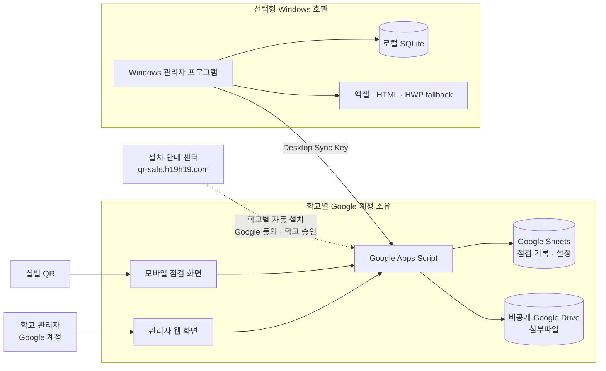

# QR-check — 학교 소유 Google 기반 보안 점검 시스템

> 브라우저 중심 운용. Windows 설치 불필요. 학교별 자체 Google 계정에서 동작.

홈페이지: [QR 보안점검표](https://qr-safe.h19h19.com/)

## 개요

QR-check는 학교가 소유한 Google Apps Script / Sheets / Drive 기반 보안 점검 시스템이다.

- **QR 방문자**: Google 로그인 없이 QR로 점검 제출 (담당자/당직자, 항목별 정상/이상, 사진·PDF 첨부 ≤5MB, 비고)
- **학교 관리자**: Google 신원으로 로그인 후 기록 확인·확정, 날짜 필터, QR 생성, 내보내기
- **중앙 정적 홈페이지**: main / maker / demo / guide / help / update 제공. 기록·비밀·첨부 중앙 저장 없음
- **학교 경계 내 저장**: 점검 기록·설정은 Sheets, 첨부파일은 비공개 Drive에 저장

> 신규 학교 자동 설치는 테스트 계정에서 실제 Google 자원 생성과 제출까지 검증했습니다. 일반 학교 공개는 OAuth 앱 게시·검증 전까지 제한됩니다.

## 현재 상태

2026-09-10 기준으로 설치센터 OAuth 연결, 학교 소유 Drive 폴더·Sheet·Apps Script 프로젝트 생성, 버전·웹앱 배포, 소유자 초기 설정, QR 제출, 관리자 조회·상세·확인을 신규 테스트 학교에서 확인했습니다. 관리자 웹에서 담당자·당직자를 직접 추가·중지할 수 있는 런타임 `0.1.1`을 준비했습니다.

| 항목 | 상태 |
|---|---|
| 홈페이지 | `https://qr-safe.h19h19.com` HTTPS 및 GitHub Pages 배포 확인 |
| 신규 학교 설치 E2E | 테스트 사용자 계정에서 Google 자원 생성 → 초기 설정 → QR 제출 → 관리자 확인 완료 |
| 데이터 소유 | 학교 계정의 Sheets·Drive·Apps Script에 저장. 중앙 서버에 학교 기록·첨부·비밀키를 저장하지 않음 |
| 웹 관리자 | 기록 조회·상세·확인, 장소·QR 관리, 담당자·당직자 관리 제공 |
| 설치센터 OAuth | Google Cloud 테스트 상태. 등록된 테스트 사용자만 설치 가능 |
| 일반 학교 공개 | 아직 제한됨. OAuth 앱 게시 및 Google 검증이 남아 있음 |
| 추가 검증 필요 | 교육용 Workspace 정책, 실물 휴대전화·인쇄 QR, 첨부파일 실기기 업로드, 업데이트·롤백 라이브 검증 |

## 아키텍처 요약



상세 다이어그램과 경계·권한 설명은 [docs/ARCHITECTURE.md](docs/ARCHITECTURE.md)를 본다.

실선은 학교 운영 데이터 흐름, 점선은 설치센터가 학교 계정에 독립 자원을 만드는 흐름입니다. 설치센터가 중단되어도 이미 배포된 학교 웹앱은 학교 계정에서 계속 동작합니다.

## 소스 구성

| 디렉터리 | 내용 |
|---|---|
| `installer/` | 정적 6개 페이지 및 `auth`/`google`/`install`/`update` 모듈 |
| `apps-script/` | 학교 런타임 |
| `admin-desktop/` | 선택적 레거시 Windows 클라이언트 (일반 웹 사용에 불필요) |
| `tools/` | `build-site.mjs`, `build-runtime.mjs`, `clasp-push.mjs` |
| `tests/gas/` | 런타임 테스트 |
| `docs/review/`, `docs/operator/`, `docs/user/`, `docs/privacy/` | 검토·운영·사용·개인정보 문서 |
| `legacy/original/` | 분석 전용 |

## 기능 (소스 기준)

- QR 제출 폼: 담당자/당직자, 항목별 정상/이상, 이미지·PDF 첨부(≤5MB 검증), 비고, 기록 상세
- 관리자 확정, 날짜 필터, 장소·QR 관리, 담당자·당직자 관리, 내보내기
- 일괄 확정은 정상만 가능. 이상은 상세 확인 후 개별 확정 필요
- 관리자 인증: 학교 config에 등록된 Google 신원만 허용. 빈 신원/미등록 신원 거부. 신규 웹 경로에 공유 admin-token 우회 없음

## 로컬 확인 명령 (저장소 루트, PowerShell)

> 새로운 빈 출력 디렉터리를 선택한다. 빌드는 미발행 사이트이며 설치 가능 릴리스가 아니다.

```powershell
node --experimental-vm-modules --test --test-reporter=spec installer/tests/*.test.mjs installer/src/install/*.test.mjs installer/src/update/*.test.mjs tests/gas/*.test.mjs
node tools/build-site.mjs --out "$env:TEMP/qr-check-site-unique-output"
python -m http.server 57919 --directory "$env:TEMP/qr-check-site-unique-output"
```

런타임 빌드와 Google 승인 설정은 `tools/` 및 아래 운영 문서를 참고하세요.

## 유용한 링크

- [docs/review/EXISTING_V11_COMPARISON_20260909.md](docs/review/EXISTING_V11_COMPARISON_20260909.md)
- [docs/review/LIVE_VALIDATION_REPORT.md](docs/review/LIVE_VALIDATION_REPORT.md)
- [docs/operator/INSTALLER_OAUTH_SETUP.md](docs/operator/INSTALLER_OAUTH_SETUP.md)
- [docs/privacy/DATA_FLOW_AND_PERMISSIONS.md](docs/privacy/DATA_FLOW_AND_PERMISSIONS.md)
- [admin-desktop/README.md](admin-desktop/README.md)

레거시 문서는 구 데스크톱 흐름 기술일 수 있다. 역사적 참고로만 본다.

## 브랜치와 배포

- `main`: 현재 학교 소유 웹 방식의 기준 소스. 기존 `work/school-owned-web` 작업과 갱신 문서를 반영합니다.
- [`codex/archive-main-20260909`](https://github.com/h19h29-design/QR-check/tree/codex/archive-main-20260909): 전환 전 `main` 커밋 `d416bde` 보존.
- `gh-pages`: 빌드된 홈페이지 배포물. 소스의 `main` 변경만으로 홈페이지나 Google Apps Script가 자동 갱신되지는 않습니다.
