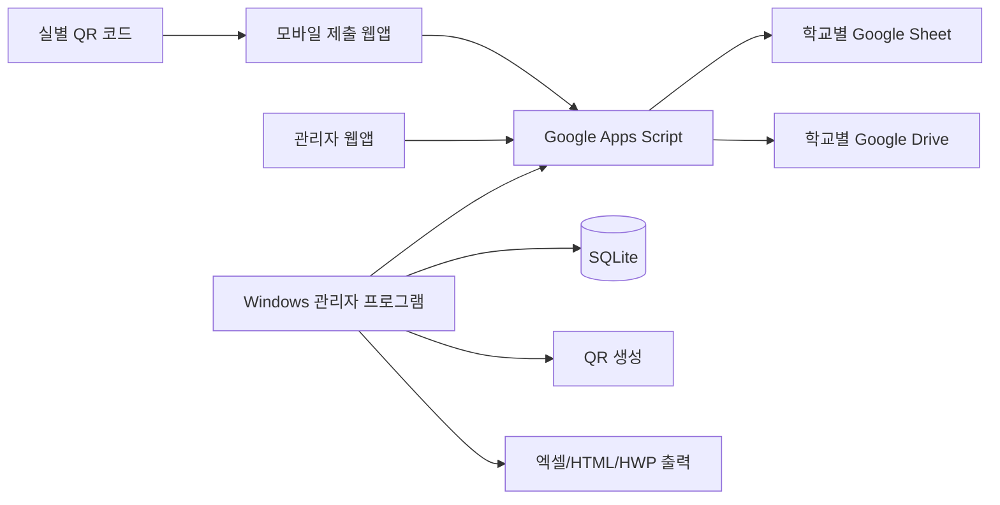
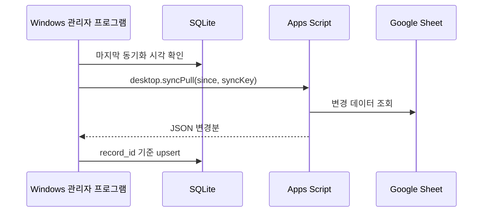

# 01. 전체설계서

## 목표

학교별 Google Drive와 Google Sheet를 중간 저장소로 사용하여 무료 배포 가능한 QR보안점검표 시스템을 만든다. 점검자는 Google 로그인 없이 QR만 스캔하고, 관리자는 퇴근 후에도 Google Apps Script 관리자 웹앱으로 확인하며, 학교 PC가 켜지면 Windows 관리자 프로그램이 데이터를 자동 동기화한다.

## 전체 구조

## Google Sheet 시트

- `settings_school`: 학교명, 타임존, Drive 폴더 ID, sync key hash 등
- `settings_admins`: 관리자 이메일 허용 목록
- `settings_rooms`: 실 목록과 submit token hash
- `settings_people`: 담당자/당직자 목록
- `settings_check_items`: 점검항목 목록과 순서
- `submissions`: 제출 기록
- `attachments`: 첨부파일 Drive 메타데이터
- `audit_log`: 관리자/동기화/제출 감사 로그

## Apps Script API

`doGet`:

- `page=submit`: 모바일 제출 화면
- `page=admin`: 관리자 웹 화면
- `page=setup`: 초기 설정 화면
- `page=health`: 연결 테스트 JSON
- `page=csv`: CSV 다운로드

`doPost` action:

- `setup.initialize`
- `public.bootstrap`
- `submit.create`
- `admin.listSubmissions`
- `admin.getDetail`
- `admin.verifyRecord`
- `admin.bulkVerifyNormal`
- `desktop.syncPull`
- `desktop.pushSettings`

## 모바일/PWA 정책

- QR URL: `...?page=submit&roomId={room_id}&submitToken={submit_token}`
- 모든 항목 기본값은 `이상 무`
- 담당자 또는 당직자 중 하나 선택
- 이상 유 선택 시 첨부 영역 강조
- 이미지/PDF만 첨부
- 파일 1개 최대 5MB
- 제출 실패 시 localStorage에 임시 저장
- 앱을 다시 열면 미전송 자료 재전송
- `record_id`로 중복 제출 방지

## 관리자 웹 정책

- 오늘/날짜별 조회
- 상세보기
- 첨부파일 링크 확인
- 관리자 메모
- 이상 없음 일괄확인
- 이상 있음은 일괄확인 제외, 상세보기 후 개별확인
- CSV 다운로드
- 모든 관리자 작업은 `audit_log` 기록

## Windows 관리자 프로그램

스택:

- Python 3.11+
- PySide6
- SQLite
- requests
- qrcode
- openpyxl
- PyInstaller
- pytest

주요 메뉴:

- 대시보드
- 점검기록
- 실 관리
- 담당자/당직자 관리
- 점검항목 관리
- QR 생성
- 출력/보관
- 설정

## 동기화

Google Sheet를 원본으로 보고 로컬 SQLite는 캐시와 출력/보관 DB로 사용한다.

## 출력

기본 출력:

- XLSX
- HTML 인쇄

선택 출력:

- 한글 프로그램 + pywin32 COM이 있으면 HWP 저장 시도
- 실패하면 HTML 인쇄물로 fallback

