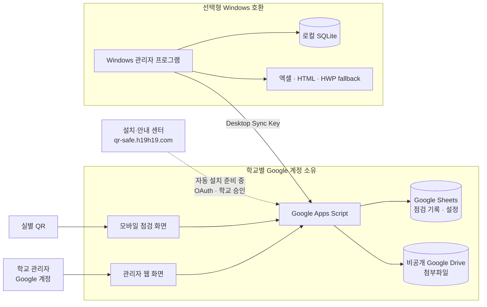

# ARCHITECTURE — QR-check 상세 아키텍처

> 학교 소유 Google 런타임. 중앙에 기록·비밀·첨부 저장 없음. 브라우저 운용 중심.

## 1. 전체 다이어그램

## 2. 영역과 책임

### 2.1 중앙 (유지관리자·정적 홈페이지)

- 정적 설치/도움/업데이트 센터와 버전별 런타임 배포물을 관리한다.
- 중앙 정적 홈페이지(`main`, `maker`, `demo`, `guide`, `help`, `update`)를 제공한다.
- 사이트는 점검 기록·비밀·첨부를 중앙에 저장하지 않는다.
- 호스팅: GitHub Pages `gh-pages` 브랜치, 커스텀 도메인 `qr-safe.h19h19.com`, Cloudflare DNS는 `h19h29-design.github.io`로의 CNAME만 설정.
- 2026-09-09 기준 HTTP 확인됨, HTTPS 인증서 발급 대기 중 (당시 확인 기준).
- 홈페이지 버튼은 기존 v11 Google 테스트 웹앱을 연다 (합성 기록만 사용, 실제 배포 ID 문서에 기재하지 않음).
- 홈페이지 배포는 Apps Script를 배포하지 않는다.
- 공개 웹사이트 배포와 학교 런타임 릴리스 준비는 별개이다.

### 2.2 학교 경계 (학교 자체 Google 계정)

- 학교 설치 흐름(점선, 아직 라이브 검증 안 됨): OAuth/승인 후 학교 자체 Google 계정에 리소스를 생성한다.
- 구성 요소:
  - 공개 QR 제출 웹앱: Google 로그인 없음. `room_id` + `submit_token` 해시 검증.
  - 인가된 Google 관리자 웹앱: 학교 config에 등록된 Google 신원만 허용. 빈 신원·미등록 신원 거부. 신규 웹 경로에 공유 admin-token 우회 없음.
  - Apps Script 처리, Sheets(기록·설정), 비공개 Drive(첨부파일).
- 학교 운용은 설계상 중앙과 독립적이다. 실제 차단/해지 라이브 검증은 아직 대기 중이다.

### 2.3 배포 형태 구분

| 구분 | 설명 |
|---|---|
| 기존 v11 결합 배포 | 공개+관리가 결합된 기존 테스트 웹앱 구성 (역사적 실증거: 정상/이상 사진 제출 → 동일 Sheet/관리자 기록/비공개 Drive, 과거 Gmail 증거 기준) |
| 공개/관리자 분리 빌드 | 공개용·관리자용 분리 빌드 코드가 존재한다. 신규 학교 자동 설치의 실제 배포 검증은 미완료다 |

### 2.4 선택적 레거시 호환

- Windows 관리-데스크톱(SQLite/Excel/HTML/HWP 폴백)은 선택적 레거시 호환이며 일반 웹 사용에 필요하지 않다.
- `Desktop Sync Key`로 연결된다. 상세는 `admin-desktop/README.md` 참조 (역사적 흐름 포함 가능).

## 3. 인증·권한·데이터 흐름

- QR 방문자: Google 로그인 없음. `room_id` + `submit_token` 해시 검증 후 제출 (담당자/당직자, 항목별 정상/이상, 이미지·PDF ≤5MB 검증, 비고).
- 학교 관리자: Google 신원 필수. 학교 config 등록 신원만 허용. 빈 신원/미등록 신원 거부. 공유 admin-token 폴백 없음 (신규 웹 경로).
- 기록 상세 조회, 관리자 확정, 날짜 필터, QR 생성, 내보내기 제공.
- 일괄 확정은 정상 항목만 가능. 이상 항목은 상세 확인 후 개별 확정.
- 데이터 흐름과 권한 상세는 `docs/privacy/DATA_FLOW_AND_PERMISSIONS.md`를 본다.

## 4. 설치·릴리스 상태 (차단 사항)

- 신규 학교 자동 설치 차단됨:
  - OAuth 클라이언트 ID 비어 있음
  - 허용 origin/구성 설정 필요
  - 릴리스 미발행 (런타임 페이로드 없음)
- Maker 판정은 실제 API 결과·승인·VERIFIED에서만 진행한다. 데모 합성 기록은 실제 학교 저장소가 아니다.
- 설치 OAuth 설정 절차는 `docs/operator/INSTALLER_OAUTH_SETUP.md`를 본다. 실제 설정과 승인 완료 후 검증해야 한다.

## 5. 검증 상태 (2026-09-09 기준)

- 현행 소스 로컬 Node 검사 314건 통과. 신규 라이브 검증이 아니다.
- 실물 휴대폰/인쇄 QR, 교육용 Workspace, 설치 OAuth E2E, 실제 롤백, 중앙-독립 테스트는 대기 중이다.
- 기존/현행 다이제스트 불일치는 런타임 업그레이드 전 알려진 현안이다. `docs/review/EXISTING_V11_COMPARISON_20260909.md`를 본다.
- 라이브 검증 기록은 `docs/review/LIVE_VALIDATION_REPORT.md`를 본다.
- 레거시 문서는 구 데스크톱 흐름 기술일 수 있으므로 역사적 참고로만 본다.

## 6. 소스·도구 대응

| 경로 | 역할 |
|---|---|
| `installer/` | 정적 6개 페이지, `auth`/`google`/`install`/`update` 모듈 |
| `apps-script/` | 학교 런타임 |
| `admin-desktop/` | 선택적 레거시 Windows 클라이언트 |
| `tools/build-site.mjs` | 정적 사이트 빌드 |
| `tools/build-runtime.mjs`, `tools/build-release.mjs` | 런타임·릴리스 빌드 |
| `tests/gas/` | 런타임 테스트 |
| `docs/review/`, `docs/operator/`, `docs/user/`, `docs/privacy/` | 검토·운영·사용·개인정보 문서 |
| `legacy/original/` | 분석 전용 |

## 7. 소스와 배포

현재 기준은 `main`이며, 전환 전 `d416bde`는 `codex/archive-main-20260909`에 보존한다.
`gh-pages`는 별도 정적 배포 브랜치다. 소스 커밋·홈페이지 배포·학교 Apps Script 배포는 각각 별도 작업이다.

[README로 돌아가기](../README.md)
