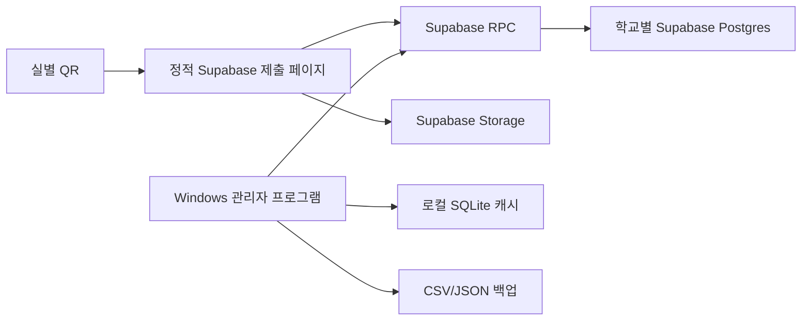

# Supabase Mode Design

## 목표

기존 Google Drive/Sheet 모드를 유지하면서 Supabase를 선택 가능한 저장소 모드로 추가한다. 각 학교는 자기 Supabase 계정과 프로젝트를 만들며, 개발자는 중앙 서버를 운영하지 않는다.

## 선택한 1차 구조

## 저장소 provider

- Google: 기존 `AppsScriptClient` 유지
- Supabase: `SupabaseClient` 추가
- 공통 import 계약: `sync_payload_to_db()`
- Google 커서: `last_sync_at`
- Supabase 커서: `last_sync_at_supabase`

## Supabase RPC

- `get_submit_bootstrap`: QR token 검증 후 제출 화면 데이터 반환
- `submit_check_record`: QR token 검증 후 점검 기록/항목/첨부파일 metadata 저장
- `desktop_health`: Desktop Sync Key 검증 및 schema version 확인
- `desktop_pull`: 데스크톱 동기화 payload 반환
- `desktop_push_settings`: 실/인원/점검항목 업로드
- `desktop_verify_record`: 관리자 확인 처리
- `desktop_bulk_verify_normal`: 이상 없음 일괄 확인
- `desktop_backup`: 전체 백업 JSON 반환

## 보안 설계

- 주요 테이블 RLS 활성화
- `schema_version`만 anon select 허용
- 나머지 테이블은 직접 anon 접근 금지
- 제출자는 `room_id + submit_token`을 RPC 내부에서 검증
- 관리자는 `organization_code + Desktop Sync Key`를 RPC 내부에서 검증
- service_role key 불필요

## 첨부파일

1차 구현은 Supabase Storage private bucket `check-attachments`를 만든다. 제출 RPC가 attachment metadata와 `storage_path`를 만든 뒤, 제출 페이지가 해당 경로로 파일을 업로드한다. 자동 백업은 1차에서 metadata CSV/JSON까지 제공하고, 파일 본문 다운로드는 후속 작업으로 남긴다.

## Hybrid 모드 여지

이번 구현에는 포함하지 않았다. 향후 `StorageProvider`에 Google Drive export sink를 추가하면 Supabase를 원본 DB로 쓰면서 Google Drive를 출력물 백업 저장소로 사용할 수 있다.

## 참고

- Supabase RLS: https://supabase.com/docs/guides/database/postgres/row-level-security
- Supabase Storage access control: https://supabase.com/docs/guides/storage/security/access-control
- Supabase API security: https://supabase.com/docs/guides/api/securing-your-api
